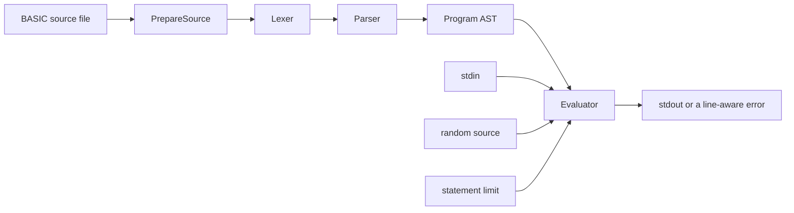

# How go-basic works

go-basic keeps the command-line interface thin and puts language behavior in
`pkg/interpreter`. A source file moves through preparation, lexing, parsing,
and evaluation before its output reaches the terminal.

## 1. Command-line boundary

`cmd/go-basic` owns operating-system concerns: flags, the source-file read,
standard streams, version output, and process exit status. It passes injected
input, output, randomness, and execution limits to the interpreter rather than
implementing BASIC behavior itself.

This separation lets unit tests and the black-box CLI suite exercise the same
product implementation with deterministic dependencies.

## 2. Source preparation

`interpreter.PrepareSource` normally returns line-numbered Microsoft BASIC
unchanged. That preserves strict parsing and useful diagnostics for ordinary
programs.

The pinned corpus also contains an explicitly annotated Checkers source. A
standalone `Sub_Start` marker opts that source into a small compatibility
lowering pass. The pass converts its `LOOP`/`ENDLOOP`, block
`IF`/`ENDIF`, `BREAK`, `THEN BREAK`, numeric labels, `#` comments, and `==`
equality notation into strict numbered BASIC. It then follows the same lexer,
parser, and evaluator path as every other program.

Malformed or unclosed structured blocks fail during preparation. Merely using
the text `Sub_Start` inside a string does not enable the extension.

## 3. Lexing

The lexer reads the prepared source one byte at a time and emits tokens with
source line and column information. It recognizes BASIC keywords without
requiring whitespace between every token, preserves string contents, supports
numeric exponent forms, and reports illegal or unterminated input instead of
panicking.

## 4. Parsing

The parser builds an abstract syntax tree (AST): a `Program` containing a map
of BASIC line numbers to statements plus a sorted execution order. Duplicate
line numbers and unsupported syntax are diagnostics.

Statements use dedicated parsing methods. Expressions use a Pratt parser so
operator precedence and right-associative exponentiation are encoded in one
place. Colon-separated statements become a sequence attached to their BASIC
line.

## 5. Evaluation

Before execution, the evaluator collects literal `DATA` values and flattens
statement sequences into an instruction list for each sorted BASIC line. It
then advances using a BASIC-line index and an index within that line.

Runtime state includes:

- case-insensitive scalar variables and typed arrays;
- a stack for nested `FOR`/`NEXT` loops;
- a return stack for `GOSUB`/`RETURN`;
- the current `DATA` read position;
- user-defined `DEF FN` functions;
- output-column tracking for comma zones, semicolons, and `TAB`; and
- injected input, random, sleep, line-observer, and statement-limit behavior.

Control-flow statements update the execution position explicitly. A jump to a
missing line, a mismatched loop, invalid input type, out-of-range subscript, or
other runtime violation returns an error annotated with the active BASIC line.

## Deterministic acceptance

The ordinary test suite covers the lexer, parser, evaluator, and real CLI. Two
external-corpus tiers add broader evidence:

- `make corpus-smoke` parses and executes all 112 pinned byte-distinct source
  variants under deterministic bounds.
- `make corpus-playable` drives complete repeatable CLI scenarios and verifies
  transcripts or meaningful gameplay milestones.

The corpus is an acceptance suite rather than a runtime dependency. Its pinned
commit, inventory, termination rules, and known exception are documented in
[compatibility](compatibility.md).

## Package map

| Path | Responsibility |
| --- | --- |
| `cmd/go-basic/` | CLI adapter and exit behavior |
| `pkg/interpreter/` | Tokens, lexer, AST, parser, structured lowering, and evaluator |
| `cmd/corpus-*/` | Commands for fetching and running the pinned corpus |
| `internal/corpus/` | Corpus verification, discovery, and bounded execution |
| `test/` | Black-box CLI tests and BASIC fixtures |

See the [language reference](language-reference.md) for the supported syntax
that flows through this pipeline.
